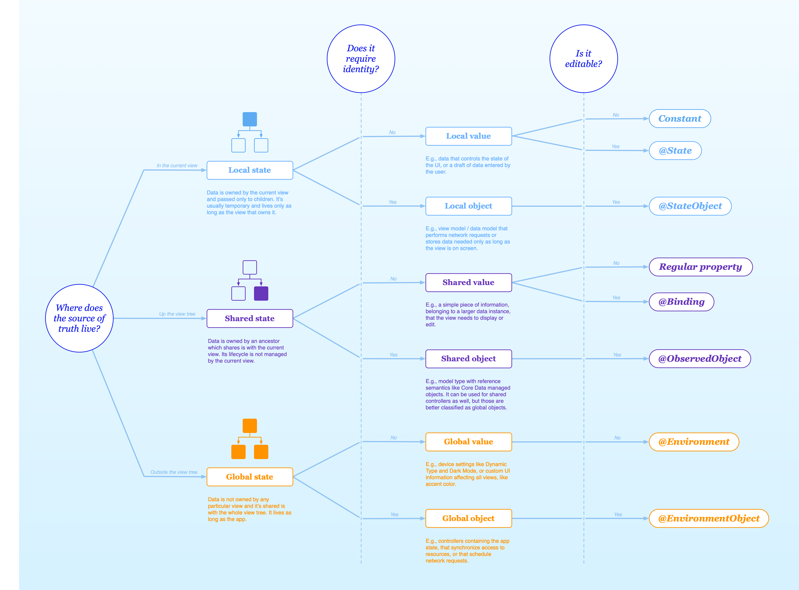

# SwiftUI

# Property Wrappers
* [Hacking With Swift: All property wrappers](https://www.hackingwithswift.com/quick-start/swiftui/all-swiftui-property-wrappers-explained-and-compared)

 

<!-- ![swiftUI_wrappers][my_image] -->
<!--  -->
![swiftUI_wrappers][my_image]

<!-- [swiftUI_wrappers][my_image]
[swiftUI_wrappers](my_image) -->

# @Environment

## Contribute

Use the `.environment(...)` function on any `View`

```swift
@main
struct hotkeyTestApp: App {
    private let viewModel = ViewModel()   
    var body: some Scene {
        WindowGroup {
            ContentView()
                .environment(viewModel)
        }
    }
}
```

## Consume

In order to keep your object private, I found it necessary to use `@Environment(ViewModel.self)` as plain `@Environment` did not work for me. 

```swift
struct ContentView: View {
    @Environment(ViewModel.self)
    private var viewModel: ViewModel
    // ...
}

```

## Create your own Environment key/value with @Entry

[Hacking with Swift](https://www.hackingwithswift.com/quick-start/swiftui/how-to-create-and-use-custom-environment-values)

```swift
extension EnvironmentValues {
    @Entry var iconColor: Color = .red
}

struct ContentView: View {
    var body: some View {
        HStack {
            BubblesView()
                .environment(\.iconColor, .blue)

            BubblesView()
                .environment(\.iconColor, .red)
        }
    }
}
```


## MenuBarExtra

Articles:
* [blog.schurigeln.com](https://blog.schurigeln.com/menu-bar-apps-swift-ui/)
* [sarunw.com](https://sarunw.com/posts/swiftui-menu-bar-app/#add-a-menu-bar-extra)

Apple Docs
* [MenuBar](https://developer.apple.com/design/human-interface-guidelines/the-menu-bar#menu-bar-extras)
* [MenuBarExtra](https://developer.apple.com/documentation/swiftui/menubarextra) 


## Multiple Windows

Apple Docs:
* [Multiple Windows](https://developer.apple.com/videos/play/wwdc2022/10061/)
* [OpenWindowAction](https://developer.apple.com/documentation/swiftui/openwindowaction)
* [DismissWindowAction](https://developer.apple.com/documentation/swiftui/dismisswindowaction)
* [Dismiss](https://developer.apple.com/documentation/swiftui/dismissaction)
  * [macdevtutorials.com](https://macdevtutorials.com/how-to-close-window-in-macos-swiftui/)


```swift
for window in NSApp.windows {
    // window.close()
}
```

## Termiating App

```swift
NSApplication.shared.terminate(nil)
```


# Questions / Learning
* [ ] [EquatableView](https://developer.apple.com/documentation/swiftui/equatableview)
* [ ] [SubscriptionView](https://developer.apple.com/documentation/swiftui/subscriptionview)
* [ ] [TupleView](https://developer.apple.com/documentation/swiftui/tupleview)

[my_image]: images/swiftUI_wrappers_observable.png


# NavigationStack / NavigationLink / .navigationDestination

* [Article](https://www.hackingwithswift.com/books/ios-swiftui/handling-navigation-the-smart-way-with-navigationdestination)


## Built in Hashable
```swift
NavigationStack {
    List(0..<100) { i in
        NavigationLink("Select \(i)", value: i)
    }
    .navigationDestination(for: Int.self) { selection in
        Text("You selected \(selection)")
    }
}
```

## Custom Hashable

```swift
struct Item: Hashable, Identifiable {
    static let batch: [Item] = (0..<20).map { Item(i: $0) }
    var id: Int { i }
    let i: Int
    let name: String
    
    init(i: Int) {
        self.i = i
        self.name = "Item \(i)"
    }
}
```

```swift
NavigationStack {
    List(Item.batch) { item in
        NavigationLink("Item \(item.i)", value: item)
    }
    .navigationDestination(for: Item.self) { selection in
        Text("You selected \(selection)")
    }
}
```

### Custom List UI

```swift
NavigationStack {
    List(Item.batch) { item in
        NavigationLink(value: item) {
            HStack {
                Text("Item: \(item.i)")
                Spacer()
                Button {
                    print("share tapped")
                } label: {
                    Image(systemName: "square.and.arrow.up")
                }
            }
            
        }
    }
    .navigationDestination(for: Item.self) { selection in
        Text("You selected \(selection)")
    }
}
```

## Nested Push

```swift
struct Item: Hashable, Identifiable {
    static let batch: [Item] = (0..<20).map { Item(i: $0) }
    var id: Int { i }
    let i: Int
    let name: String
    
    init(i: Int) {
        self.i = i
        self.name = "Item \(i)"
    }
}

struct SubItem: Hashable, Identifiable {
    static let batch: [SubItem] = (0..<20).map { SubItem(j: $0) }
    var id: Int { j }
    let j: Int
    let name: String
    
    init(j: Int) {
        self.j = j
        self.name = "SubItem \(j)"
    }
}

struct ItemsView: View {
    var body: some View {
        NavigationStack {
            List(Item.batch) { item in
                NavigationLink("Item \(item.i)", value: item)
            }
            .navigationDestination(for: Item.self) { item in
                SubItemsView(item: item)
            }
        }
    }
}

struct SubItemsView: View {
    @State var item: Item
    var body: some View {
            List(SubItem.batch) { subitem in
                NavigationLink("SubItem \(subitem.j)", value: subitem)
            }
            .navigationDestination(for: SubItem.self) { subitem in
                VStack {
                    Text("Item.i: \(item.i)")
                    Text("Item.name: \(item.name)")
                    Text("SubItem.i: \(subitem.j)")
                    Text("SubItem.name: \(subitem.name)")
                }
            }
    }
}

#Preview {
    ItemsView()
}
```
