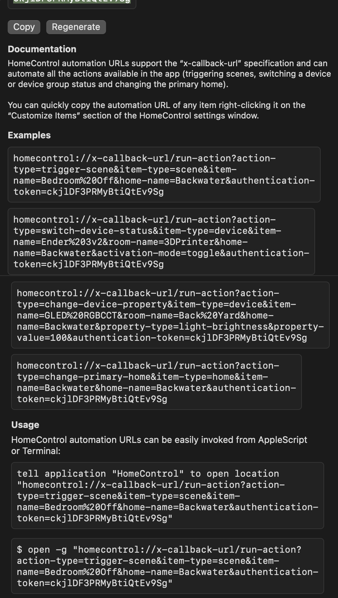

HomeControl automation URLs support the "x-callback-url" specification


```sh
export HOME_CONTROL_TOKEN='ckjlDF3PRMyBtiQtEv9Sg'
open "homecontrol://x-callback-url/run-action?action-type=trigger-scene&item-type=scene&item-name=Bedroom%20Off&home-name=Backwater&authentication-token=${HOME_CONTROL_TOKEN}"
```
```sh
"homecontrol://x-callback-url/run-action?action-type=trigger-scene&item-type=scene&item-name=Bedroom%20Off&home-name=Backwater&authentication-token=${HOME_CONTROL_TOKEN}"
```

# URL Parameters

## action-type
* trigger-scene
* switch-device-status
* change-device-property
* change-primary-home

## item-type
* scene
* device
* home

## item-name
* <name of a device, HTML encoded>

## home-name
* <name of a home, HTML encoded>

## authentication-token
* Get from HomeControl settings

# Bash Script
See Bash Script wrapper
* [home_control](/Users/zakkhoyt/.zsh_home/scripts/scripts/home/home_control)
* [GitLab](https://gitlab.com/zakkhoyt/zsh_home/-/blob/main/backup/shell/home/home_control)
* [HatchMobile](https://github.com/hatch-mobile/zakk_scripts/blob/main/shell/home/home_control)