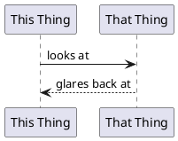
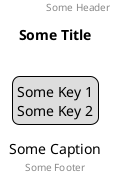
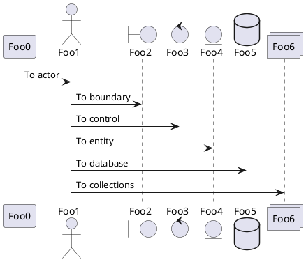
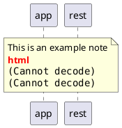
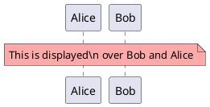
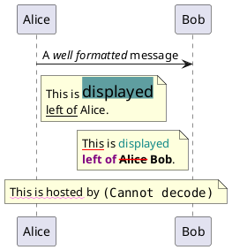
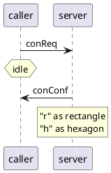
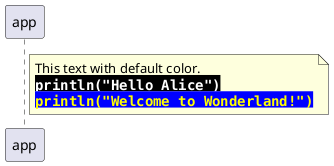
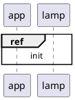

# About
This document is a quick guide / tutorial / reference to using [PlantUML](https://plantuml.com/). 

PlantUML is a component that allows to programmatically write Sequence, Usecase, Class, Object, Activity, Component, Deployment, State, Timing diagrams. 

## Example
### Code
```

@startuml
participant "This Thing" as this
participant "That Thing" as that

this -> that: looks at
this <-- that: glares back at

@enduml
```

### Diagram
(Rendered with PlantUML)



### Themes

```plantuml
' Use custom Hatch themeOptions (requires "puml-themeOptions-hatch.puml")
!theme hatch

' normal puml code here
```


# VSCode Extensions


IMO, the best tool for the job is [VSCode](https://code.visualstudio.com/), which has wonderful open source 3rd party extensions (including PlantUML). 

Here are some recommended extensions:

## Export/Preview

[Marketplace](https://marketplace.visualstudio.com/items?itemName=jebbs.plantuml)

To render a preview in VSCode's Secondary Editor:
`cmd` + `shift` + `p` -> `PlantUML: Preview Current Diagram`

Similar, to render the graph out to png, pdf, etc..:
`cmd` + `shift` + `p` -> `PlantUML: Export Current Diagram`
(Then answer the questions)


## Markdown Code Fence Support
[Marketplace](https://marketplace.visualstudio.com/items?itemName=myml.vscode-markdown-plantuml-preview)

This extentsion adds PlantUML rendering to markdown files / previews. 

To preview a markdown file (regardless of this plugin): 
`cmd` + `shift` + `p` -> `Markdown: Open preview to the side`


# References
* [PlantUML Language Reference](https://pdf.plantuml.net/1.2020.22/PlantUML_Language_Reference_Guide_en.pdf)
* [PlantUML Syntax](https://plantuml-documentation.readthedocs.io/en/latest/diagrams/sequence.html)
* [Hitchhiker's guide](https://crashedmind.github.io/PlantUMLHitchhikersGuide/) This is a terrific starting point:
  * Several diagram examples 
  * Standard Library
  * Functions / Keywords
  * Colors / Themes
  * Layouts

* [Diagram Elements](https://crashedmind.github.io/PlantUMLHitchhikersGuide/PlantUMLSpriteLibraries/plantuml_sprites.html#deployment-diagram-elements) EX: actor, participant, node, database, etc...
* [Online Server](https://www.plantuml.com/plantuml/uml/SyfFKj2rKt3CoKnELR1Io4ZDoSa70000) Write/develop your code using this online interface.
* [Ortho-lines](https://forum.plantuml.net/1608/is-it-possible-to-only-use-straight-lines-in-a-class-diagram) Use different line types other than the default (curved). `Ortho` and `polyline` are now suppoted.
## Themes
* [Themes](https://plantuml.com/theme)
* [Theme Gallery](https://the-lum.github.io/puml-themes-gallery/)
* [GitHub](https://github.com/plantuml/plantuml/tree/master/themes)w
## Skin
* [skin parameters](https://plantuml.com/skinparam)
* [all skin params](https://plantuml-documentation.readthedocs.io/en/latest/formatting/all-skin-params.html)
* [css skin files](https://github.com/plantuml/plantuml/blob/master/skin/plantuml.skin)


# Examples

## Structure




## Participants




## Markup
### HTML 
It is also possible to use few html tags like:
```html
<b>
<u>
<i>
<s>, <del>, <strike>
<font color="#AAAAAA"> or <font color="colorName">
<color:#AAAAAA> or <color:colorName>
<size:nn> to change font size
 or : the file must be accessible by the filesystem
```



### Markdown (Creole)




## Note

### Fonts


### HTML




### Shapes
`rnote` and `hnote` (rect, hexagon)



### Code Blocks
```puml
' https://stackoverflow.com/a/65733853/803882
note right of app
    This text with default color.
    <code>
    println("Hello Alice")
    println("Welcome to Wonderland!")
    </code>
end note
```




## Divider
```puml
@startuml
== My Divider ==
@enduml
```

## Reference

